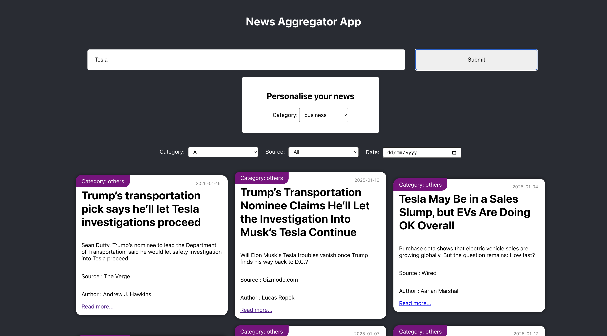
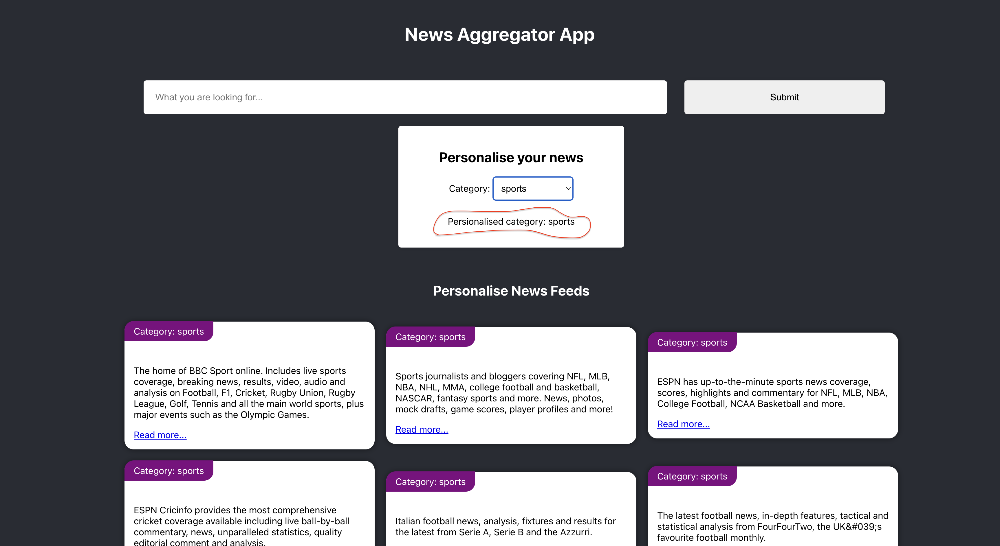

# News Aggregator App
## Pre- requisite
- Required Node version v22.12.0 `https://nodejs.org/en/download`
- Need any code editor if want to see code (Visual studio code)

## How to run?

Steps:

- Clone `git clone https://github.com/DeepWebD/New_Aggregator_App.git`
- move project folder
- Run `npm install`
- Run `npm run dev`

## What's in application

- I have utilized three different News APIs to enable news search functionality..
- I am implementing personalized news feeds by storing the user's selected feed categories in local storage. Since we do not have a user profile system, the application retrieves these preferences from local storage upon loading. Based on the stored choices, an API call is made to display the personalized feed.
- The application is fully responsive, ensuring an optimal user experience across all device types and screen sizes.".

## How to use this application

- Launch the application and enter the keyword you want to search for. For example, if you're looking for news about Tesla, simply type 'Tesla' into the search field and click on Search button.

  

- We have filter option by categoty, source, and date.

- You can personalize the news feed by selecting a category from the dropdown menu. Currently, personalization is based only on categories because the API used for fetching personalized news does not provide options for filtering by author or source. However, the implementation would be similar if author or source-based personalization were available.

- If you have a personalized news feed enabled and perform a search, your personalized news feed will appear at the bottom of the page..
